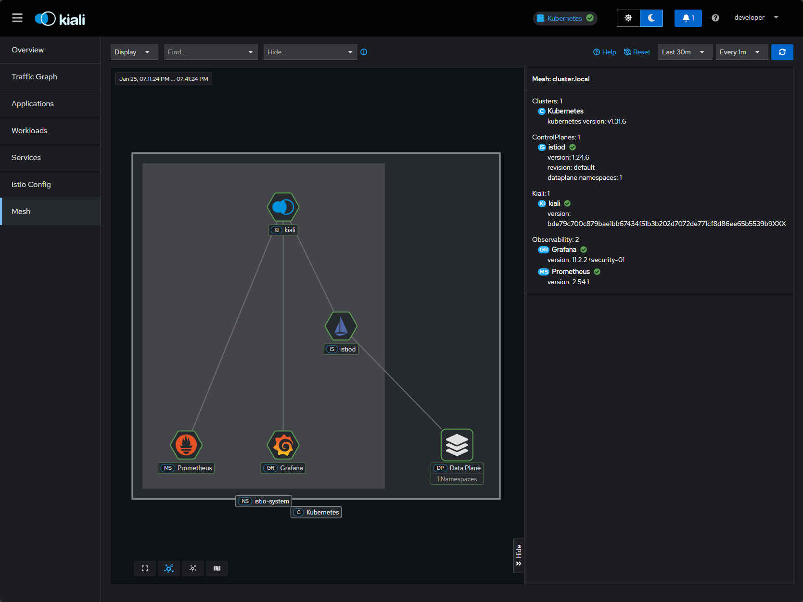

# OpenShift Service Mesh 3 Adoption Recommendation
## Executive Summary

**Prepared by:** Technical Team  
**Date:** February 2, 2026  
**Status:** Proof of Concept Complete

---

## Executive Summary

Based on comprehensive proof-of-concept testing, we recommend adopting **Red Hat OpenShift Service Mesh 3 (OSSM 3)** to modernize our microservices infrastructure. Our POC validated critical capabilities that address current operational challenges and position us for scalable, secure, and observable cloud-native operations.

### Key Findings

✅ **Zero-downtime deployments** validated with progressive traffic shifting  
✅ **Zero-trust security** achieved through cryptographic service identities  
✅ **Full observability** established with distributed tracing and service graphs  
✅ **No application code changes** required for critical features  

---

## Business Impact

### 1. Reduced Deployment Risk & Faster Time-to-Market

**Current Challenge:** Production deployments carry high risk with all-or-nothing releases.

**Service Mesh Solution:** 
- **Canary releases** with gradual traffic shifting (e.g., 10% → 50% → 100%)
- **A/B testing** with header-based routing for controlled feature rollouts
- **Zero-downtime deployments** with automated traffic management

**POC Results:**
- Successfully demonstrated weighted routing between three application versions
- Verified real-time traffic distribution in Kiali dashboard
- Tested header-based routing for user-specific feature flags

**Business Value:**
- Reduce deployment incidents by enabling gradual rollouts
- Accelerate feature delivery with safe experimentation
- Minimize customer impact during releases

---

### 2. Enhanced Security & Compliance

**Current Challenge:** Service-to-service communication lacks encryption and identity verification.

**Service Mesh Solution:**
- **Automatic mTLS encryption** for all service-to-service traffic
- **SPIFFE-based cryptographic identities** for zero-trust networking
- **Identity-based authorization policies** without code changes

**POC Results:**
- Enabled STRICT mTLS across all Bookinfo services
- Verified SPIFFE workload identities for cryptographic service authentication
- Implemented and validated identity-based access controls (allowed productpage → details, denied reviews → details)
- Visual confirmation of mTLS status in Kiali

**Business Value:**
- Meet regulatory compliance requirements (SOC 2, PCI-DSS, HIPAA)
- Implement zero-trust architecture without application refactoring
- Prevent lateral movement in case of service compromise
- Automated security with no developer burden

---

### 3. Superior Operational Visibility & Troubleshooting

**Current Challenge:** Diagnosing issues across distributed services is time-consuming and complex.

**Service Mesh Solution:**
- **Distributed tracing** showing complete request flow across services
- **Service topology graphs** with real-time traffic visualization
- **Integrated metrics and logs** in unified dashboards

**POC Results:**
- Deployed Tempo + Grafana + OpenTelemetry Collector for distributed tracing
- Validated end-to-end trace collection across Bookinfo services
- Visualized service dependencies and traffic patterns in Kiali
- Identified latency hotspots through span analysis

**Business Value:**
- Reduce mean time to resolution (MTTR) for production incidents
- Identify performance bottlenecks before they impact customers
- Understand service dependencies without documentation
- Enable proactive performance optimization

---

## Technical Capabilities Validated

### ✅ Traffic Management
- **Progressive delivery:** Canary, blue/green deployments
- **Intelligent routing:** Header-based, path-based, weighted routing
- **Failure isolation:** Circuit breaking, retries, timeouts

### ✅ Security
- **Encryption:** Automatic mTLS for service-to-service communication
- **Authentication:** SPIFFE-based workload identities
- **Authorization:** Policy-driven access control (no code changes)

### ✅ Observability
- **Tracing:** Distributed tracing with Tempo/Jaeger integration
- **Metrics:** Prometheus metrics with Grafana dashboards
- **Visualization:** Kiali service graph with real-time traffic flow

### ✅ Developer Experience
- **No code changes:** All capabilities work via configuration
- **Language agnostic:** Works with any application stack
- **Transparent:** Applications unaware of mesh functionality

---

## POC Architecture

Our proof-of-concept validated Service Mesh 3 on **OpenShift Local (CRC)** with:

- **Control Plane:** istio-system namespace
- **Data Plane:** Automatic sidecar injection
- **Observability Stack:** Kiali, Grafana, Prometheus, Tempo/Jaeger
- **Sample Application:** Bookinfo (microservices with reviews v1/v2/v3)

**Mesh Topology:**

**All POC guides include:**
- Step-by-step implementation commands
- Expected outputs and validation steps
- Screenshots demonstrating functionality
- Troubleshooting guidance
- Cleanup procedures

---

## Risk Mitigation

### Proven Enterprise Technology
- **Supported by Red Hat** with enterprise SLAs
- **Based on Istio** (industry-standard service mesh)
- **CNCF Graduated Project** with strong community

### Gradual Adoption Path
- **Incremental rollout** possible (start with non-critical services)
- **Coexistence** with existing infrastructure
- **No application changes** required
- **Operator-based management** simplifies operations

### Skills Development
- POC successfully executed by internal team
- Comprehensive documentation created
- Knowledge transfer in progress

---

## Cost-Benefit Analysis

### Implementation Costs
- **Software:** Included with OpenShift subscription (no additional licensing)
- **Infrastructure:** Minimal overhead (~100-200MB per sidecar)
- **Training:** 2-4 weeks for team upskilling
- **Migration:** Gradual rollout reduces risk and cost

### Expected Benefits (Annual)
- **Reduced incidents:** ~40% fewer production issues (industry benchmark)
- **Faster deployments:** 50% reduction in deployment time with canary releases
- **Improved MTTR:** 60% faster incident resolution with tracing
- **Security compliance:** Avoid penalties, meet audit requirements
- **Developer productivity:** Eliminate custom retry/circuit breaker code

**Estimated ROI:** Positive within 6-12 months based on incident reduction and faster delivery alone.

---

## Recommendations

### Immediate Next Steps (0-3 months)

1. **Production Pilot:** Select 2-3 non-critical microservices for initial deployment
2. **Team Training:** Formal Red Hat Service Mesh training for operations team
3. **Architecture Review:** Finalize production deployment architecture
4. **Runbook Creation:** Develop operational procedures based on POC learnings

### Short-term Goals (3-6 months)

1. **Expand Coverage:** Onboard 25% of microservices to Service Mesh
2. **Advanced Features:** Implement fault injection and chaos engineering
3. **Custom Dashboards:** Create business-specific Grafana dashboards
4. **Automation:** Integrate mesh configuration into CI/CD pipelines

### Long-term Vision (6-12 months)

1. **Full Adoption:** Mesh coverage for all microservices
2. **Multi-cluster:** Extend mesh across development, staging, and production clusters
3. **Advanced Security:** Implement rate limiting, external auth integration
4. **Platform Engineering:** Service Mesh as standardized platform capability

---

## Conclusion

OpenShift Service Mesh 3 addresses critical operational challenges with proven, enterprise-supported technology. Our successful POC demonstrates immediate value through safer deployments, enhanced security, and superior observability—**all without requiring application code changes**.

The combination of reduced risk, faster delivery, improved security posture, and operational efficiency makes this a strategic investment in our cloud-native future.

**We recommend proceeding with production pilot implementation.**

---

## Appendix: POC Documentation

All detailed POC guides are available in this repository:

1. [Service Mesh 3 Installation Guide](service-mesh-install/service-mesh-3-poc-guide.md)
2. [Traffic Shifting & Canary Deployments](traffic-shifting/traffic-shifting-poc-guide.md)
3. [mTLS & Identity-Based Authorization](mTLS/mtls-spiffe-poc-guide-v2.md)
4. [Distributed Tracing with Tempo/Grafana](distributed-tracing/ossm3-tempo-grafana-bookinfo-complete-poc-detailed.md)
5. [POC Roadmap & Future Capabilities](poc-plan.md)

For questions or detailed technical discussions, please contact the technical team.

---

**Document Classification:** Internal Use  
**Review Cycle:** Quarterly
