# OpenShift Service Mesh 3 + Tempo + Grafana + Bookinfo
## Complete Distributed Tracing & Service Graph PoC Guide

---

This document fully combines:

- Distributed Tracing Guide
- Service Graph Guide

All commands are PowerShell compatible.

---

# PART 1 – DISTRIBUTED TRACING

# Distributed Tracing PoC on OpenShift Service Mesh 3 (Istio) + OpenTelemetry Collector + Tempo + Grafana + Bookinfo

> **Goal:** Make **distributed tracing** work end‑to‑end in an OpenShift cluster using **Service Mesh 3 (Istio)**, **OpenTelemetry Collector**, **Tempo**, **Grafana**, and the **Bookinfo** sample app.  
> **Outcome:** You can generate traffic to Bookinfo, then **search traces in Grafana (Tempo datasource)** and see service-to-service spans.

---


## 0) Assumptions

- You have `oc` access to the cluster with permissions to create namespaces and resources.
- OpenShift Service Mesh 3 is installed (Istio control plane is running).
- You can reach the OpenShift router domain (e.g. `apps-crc.testing` on CRC).
- You will run commands from **PowerShell** (`pwsh`) on your workstation.

---

## 1) Namespaces used

- `istio-system` — Service Mesh control plane + Grafana + OpenTelemetry Collector
- `bookinfo` — Bookinfo app
- `tracing-system` — Tempo + MinIO (Tempo storage)
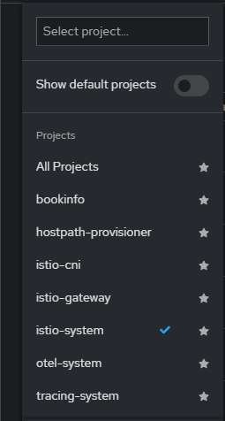
> If your environment already uses different namespaces, adjust accordingly.

---

## 2) Verify Service Mesh is healthy

```powershell
oc get pods -n istio-system
```

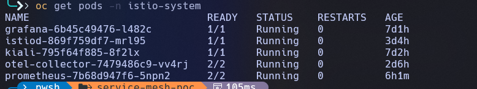
You should see `istiod` (and other components you installed) in **Running** state.

---

## 3) Install Bookinfo (sample app)

### 3.1 Create namespace and enable sidecar injection

```powershell
oc new-project bookinfo

# Enable automatic sidecar injection for this namespace
oc label namespace bookinfo istio-injection=enabled --overwrite
```

### 3.2 Apply Bookinfo manifests

If you have the Istio Bookinfo YAMLs locally, apply them. Commonly:

```powershell
# Example file names; replace with your local paths
oc -n bookinfo apply -f bookinfo.yaml
oc -n bookinfo apply -f bookinfo-gateway.yaml
```
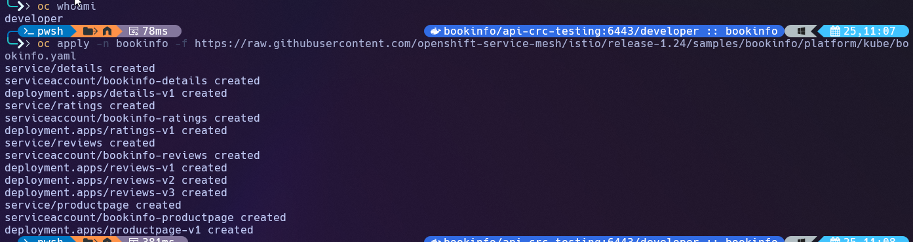

Verify pods

```powershell
oc -n bookinfo get pods -o wide
```
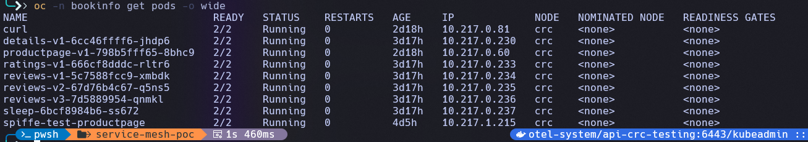

You should see each app pod with **2 containers** (`app` + `istio-proxy`).

### 3.3 (Optional) Create a test client pod (sleep)

```powershell
oc -n bookinfo apply -f https://raw.githubusercontent.com/istio/istio/release-1.24/samples/sleep/sleep.yaml
oc -n bookinfo wait --for=condition=Ready pod -l app=sleep --timeout=120s
```

---

## 4) Install Tempo (Tempo Operator / Tempo Stack)

> Your environment may already have the Tempo Operator installed. If so, skip operator install and go to the Tempo instance creation.

### 4.1 Create `tracing-system` namespace

```powershell
oc new-project tracing-system
```

### 4.2 Verify Tempo service endpoints (after install)

When Tempo is deployed, you should have a service like:

- `tempo-tempo` with ports:
  - `3200` (HTTP query)
  - `4317` (OTLP gRPC ingest)
  - `4318` (OTLP HTTP ingest)

Example check:

```powershell
oc -n tracing-system get svc tempo-tempo
oc -n tracing-system get endpoints tempo-tempo -o wide
oc -n tracing-system get pods
```
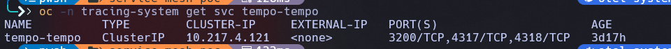

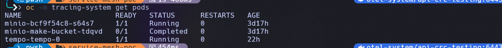

Expected `svc` shape (example):

- `tempo-tempo` ClusterIP
- endpoints include `:3200`, `:4317`, `:4318`

---

## 5) Install Grafana (in `istio-system`)

> You can install Grafana via Helm, Operator, or platform-provided charts. Use whichever you already have. The key is **Grafana is reachable** and can add a Tempo datasource.

### 5.1 Check Grafana service + route

```powershell
oc -n istio-system get svc grafana
oc -n istio-system get route grafana
```
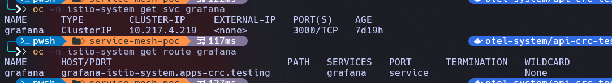
Open the route host in browser, e.g.:

```
http://grafana-istio-system.apps-crc.testing/?orgId=1
```

---

## 6) Create OpenTelemetry Collector (OTel) in `istio-system`

We will run a collector that:

- Receives OTLP from Istio proxy:
  - gRPC: `0.0.0.0:4317`
  - HTTP: `0.0.0.0:4318`
- Exports OTLP to Tempo ingest:
  - `tempo-tempo.tracing-system.svc.cluster.local:4317`
- Exposes Prometheus metrics on `8888` (optional but recommended)

### 6.1 Create collector YAML

Save as **`otel-collector.yaml`**:

```yaml
apiVersion: opentelemetry.io/v1beta1
kind: OpenTelemetryCollector
metadata:
  name: otel
  namespace: istio-system
spec:
  mode: deployment
  replicas: 1
  config:
    receivers:
      otlp:
        protocols:
          grpc:
            endpoint: 0.0.0.0:4317
          http:
            endpoint: 0.0.0.0:4318

    processors:
      batch: {}

    exporters:
      otlp:
        endpoint: tempo-tempo.tracing-system.svc.cluster.local:4317
        tls:
          insecure: true

    service:
      pipelines:
        traces:
          receivers: [otlp]
          processors: [batch]
          exporters: [otlp]

      telemetry:
        metrics:
          readers:
            - pull:
                exporter:
                  prometheus:
                    host: 0.0.0.0
                    port: 8888
```

Apply it:

```powershell
oc apply -f .\otel-collector.yaml
```

### 6.2 Verify collector pod + CR

```powershell
# Wait for the pod
oc -n istio-system get pods -l app.kubernetes.io/name=otel-collector -o wide

# Verify the CR exists
oc -n istio-system get opentelemetrycollector otel -o yaml
```
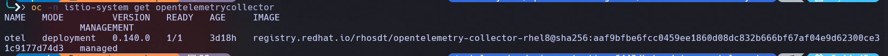

---

## 7) Configure Service Mesh (Istio) to send traces to OTel Collector

In Service Mesh 3, the recommended way is configuring the mesh/telemetry settings so Envoy sidecars send traces to your collector.

### 7.1 Configure sampling & provider (Telemetry API)

Create **`telemetry-tracing.yaml`** in `istio-system`:

```yaml
apiVersion: telemetry.istio.io/v1
kind: Telemetry
metadata:
  name: mesh-tracing
  namespace: istio-system
spec:
  tracing:
  - providers:
    - name: opentelemetry
    randomSamplingPercentage: 100
```

Apply:

```powershell
oc apply -f .\telemetry-tracing.yaml
```

> **Note:** Provider name `opentelemetry` must match what your Service Mesh control plane supports.  
> Your Envoy `config_dump` earlier confirmed `envoy.tracers.opentelemetry` is present, which is good.

### 7.2 Point Istio tracing to your collector (control plane mesh config)

In Service Mesh 3, the Istio control plane configuration is managed via the `istio` ConfigMap in the `istio-system` namespace. 

**Verify current configuration:**

```powershell
oc -n istio-system get cm istio -o yaml
```

**Expected configuration for distributed tracing:**

The ConfigMap should contain the following key settings under `data.mesh`:

```yaml
defaultConfig:
  discoveryAddress: istiod.istio-system.svc:15012
defaultProviders:
  metrics:
  - prometheus
enablePrometheusMerge: true
enableTracing: true
extensionProviders:
- name: otel
  opentelemetry:
    port: 4317
    service: otel-collector.istio-system.svc.cluster.local
rootNamespace: istio-system
trustDomain: cluster.local
```

**Key elements:**
- `enableTracing: true` - Enables tracing globally
- `extensionProviders` - Defines the OpenTelemetry collector endpoint
  - `name: otel` - Provider name (matches Telemetry API configuration)
  - `service: otel-collector.istio-system.svc.cluster.local` - OTel Collector service
  - `port: 4317` - OTLP gRPC port

> **Note:** This ConfigMap is managed by the Sail Operator (as indicated by `managed-by: sail-operator` label).  
> In Service Mesh 3, you typically don't edit this ConfigMap directly. Instead, configuration is done through:
> 1. The `Istio` or `IstioRevision` custom resources
> 2. The Telemetry API (Section 7.1)

**Verify the configuration is active:**

```powershell
# Check if tracing provider is configured
oc -n istio-system get cm istio -o jsonpath='{.data.mesh}' | Select-String -Pattern "enableTracing|extensionProviders"
```

**Get the source of truth from istiod (pilot-discovery):**

The actual mesh configuration used by istiod can be retrieved directly from the pilot-discovery API:

```powershell
# Get istiod pod name
$istiod = oc get pod -n istio-system -l app=istiod -o jsonpath='{.items[0].metadata.name}'

# Retrieve the effective mesh configuration (source of truth)
oc -n istio-system exec $istiod -c discovery -- pilot-discovery request GET /debug/mesh > meshconfig.json
```

This command dumps the **actual running mesh configuration** that istiod is using. Review `meshconfig.json` to confirm:
- `enableTracing: true`
- `extensionProviders` with your OTel collector endpoint

> **Why this matters:** The pilot-discovery endpoint shows the live configuration that istiod is actively using to configure Envoy sidecars. This is the definitive source of truth for debugging tracing issues.

**If you need to modify the configuration**, edit the `Istio` or `IstioRevision` CR (managed by Sail Operator):

```powershell
# List Istio revisions
oc -n istio-system get istiorevision

# View the current configuration
oc -n istio-system get istiorevision default -o yaml
```

> If you already confirmed in `config_dump` that sidecars are using:
>
> - `envoy.tracers.opentelemetry`
> - `cluster_name: outbound|4317||otel-collector.istio-system.svc.cluster.local`
>
> then this step is already done and working correctly.

---

## 8) Restart workloads so sidecars pick up tracing config

Restart Bookinfo deployments (example list; adjust if you have v2/v3 reviews):

```powershell
oc -n bookinfo rollout restart deploy/details-v1
oc -n bookinfo rollout restart deploy/ratings-v1
oc -n bookinfo rollout restart deploy/reviews-v1
oc -n bookinfo rollout restart deploy/productpage-v1
```

Wait for Ready:

```powershell
oc -n bookinfo get pods
```

---

## 9) Generate traffic (create spans)

If you have `sleep` pod, you can run traffic from inside the mesh:

```powershell
# Find sleep pod name
$sp = (oc -n bookinfo get pod -l app=sleep -o jsonpath='{.items[0].metadata.name}')

# Generate multiple requests
oc -n bookinfo exec deploy/sleep -c sleep -- sh -c 'for i in $(seq 1 50); do wget -qO- http://productpage:9080/productpage >/dev/null; done'
```

> If `wget` is unavailable, use any in-cluster client that can do HTTP.

---

## 10) Confirm the collector is receiving and exporting spans

### 10.1 Check collector logs

```powershell
$cp = (oc -n istio-system get pod -l app.kubernetes.io/name=otel-collector -o jsonpath='{.items[0].metadata.name}')
oc -n istio-system logs $cp --tail=200
```

### 10.2 Check collector metrics (Prometheus endpoint)

Port-forward:

```powershell
oc -n istio-system port-forward svc/otel-collector-monitoring 8888:8888
```

Open:

- `http://localhost:8888/metrics`

Look for key counters increasing:

- `otelcol_receiver_accepted_spans_total`
- `otelcol_exporter_sent_spans_total`
- `otelcol_exporter_send_failed_spans_total` should stay `0`

---

## 11) Add Tempo datasource in Grafana

In Grafana:

1. **Connections → Data sources → Add data source**
2. Choose **Tempo**
3. Set URL to Tempo query endpoint:

```
http://tempo-tempo.tracing-system.svc.cluster.local:3200
```

4. Click **Save & Test** (should succeed)

---

## 12) View traces in Grafana (Explore)

Go to **Explore** → select the Tempo datasource.

### 12.1 Search by service name

Use query:

- `resource.service.name = "productpage.bookinfo"`

You should see traces.
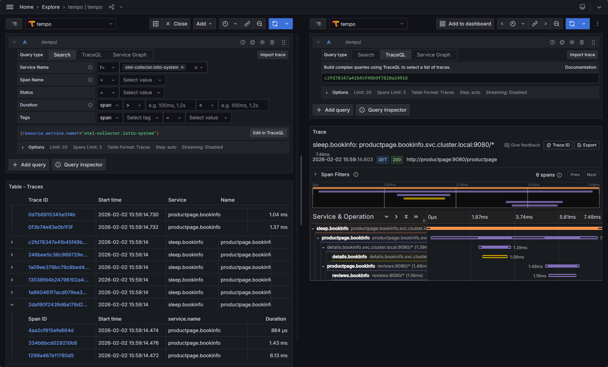
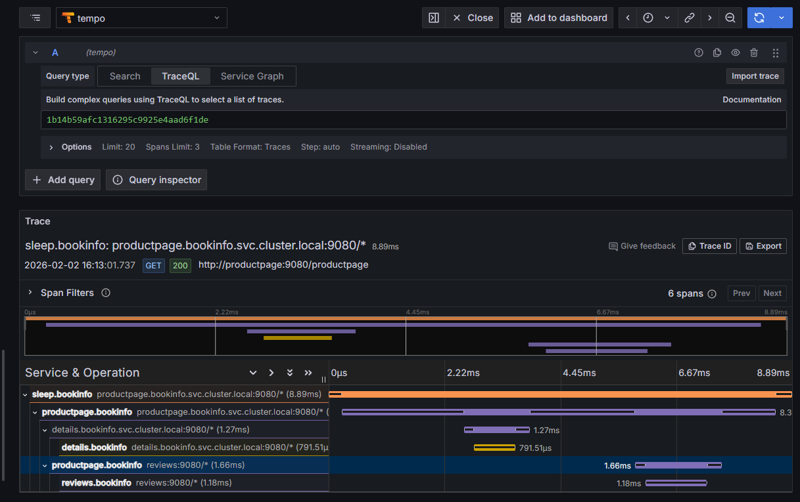

### 12.2 Service graph

In Explore, choose **Service Graph** tab to visualize:

- `productpage` calling `details`, `reviews`, etc.

---

## 13) Verify Envoy is configured for OTLP tracing (optional)

Pick a Bookinfo pod:

```powershell
$pp = (oc -n bookinfo get pod -l app=productpage -o jsonpath='{.items[0].metadata.name}')
```

Dump Envoy config and search for OTLP tracer settings:

```powershell
oc -n bookinfo exec $pp -c istio-proxy -- pilot-agent request GET config_dump | Select-String -Pattern "OpenTelemetryConfig|otel-collector"
```

You should see:

- `envoy.tracers.opentelemetry`
- `cluster_name: outbound|4317||otel-collector.istio-system.svc.cluster.local`

---

## 14) Troubleshooting cheatsheet

### A) Grafana route says “Application is not available”
```powershell
oc -n istio-system get pods -l app.kubernetes.io/name=grafana
oc -n istio-system get endpoints grafana -o wide
oc -n istio-system get route grafana -o yaml
```

### B) Collector logs show “connection refused” to Tempo `:4317`
```powershell
oc -n tracing-system get svc tempo-tempo
oc -n tracing-system get endpoints tempo-tempo -o wide
oc -n tracing-system get pod tempo-tempo-0 -o wide
```

### C) Collector is receiving spans but Tempo shows no data
- Check exporter metrics:
  - `otelcol_exporter_sent_spans_total` should increase
  - `otelcol_exporter_send_failed_spans_total` should be 0

### D) Traces exist but services look incomplete
- Ensure sidecars are injected on app pods and restarted after telemetry config.
- Ensure sampling is 100%.

---

## 15) Cleanup (optional)

```powershell
oc delete namespace bookinfo
oc delete namespace tracing-system
oc delete opentelemetrycollector otel -n istio-system
oc delete telemetry mesh-tracing -n istio-system
```

---

## Appendix: Quick “PoC Summary Commands”

```powershell
# Bookinfo namespace with injection
oc new-project bookinfo
oc label namespace bookinfo istio-injection=enabled --overwrite

# Apply Bookinfo (replace paths)
oc -n bookinfo apply -f bookinfo.yaml
oc -n bookinfo apply -f bookinfo-gateway.yaml

# Deploy OTel collector
oc apply -f .\otel-collector.yaml

# Enable tracing (100% sampling)
oc apply -f .\telemetry-tracing.yaml

# Restart Bookinfo workloads
oc -n bookinfo rollout restart deploy/productpage-v1
oc -n bookinfo rollout restart deploy/reviews-v1
oc -n bookinfo rollout restart deploy/details-v1
oc -n bookinfo rollout restart deploy/ratings-v1

# Generate traffic (sleep)
$sp = (oc -n bookinfo get pod -l app=sleep -o jsonpath='{.items[0].metadata.name}')
1..30 | ForEach-Object {
  oc -n bookinfo exec $sp -c sleep -- sh -c "wget -qO- http://productpage:9080/productpage > /dev/null"
}

# Tempo datasource URL in Grafana
# http://tempo-tempo.tracing-system.svc.cluster.local:3200
```

---

# PART 2 – SERVICE GRAPH


# Service Mesh 3 + Tempo (Monolithic) + Grafana  
## Distributed Tracing & Service Graph PoC (OpenShift Local / CRC)

---

## Architecture Overview

Bookinfo  
→ Istio Envoy Sidecar  
→ OTLP Spans  
→ Tempo (Monolithic)  
→ Metrics-Generator  
→ Prometheus  
→ Grafana (Traces + Service Graph)

---

## Prerequisites

- OpenShift Local (CRC)
- Red Hat Service Mesh 3 installed
- Bookinfo application deployed
- Grafana accessible
- Prometheus running in istio-system
- Tempo Operator installed

---

## Verify Tempo Operator & TempoMonolithic

```powershell
oc get csv -A | Select-String tempo
oc get tempomonolithics -A
```

---

## Enable Metrics-Generator

```powershell
oc -n tracing-system patch tempomonolithic tempo --type merge -p @'
{
  "spec": {
    "extraConfig": {
      "tempo": {
        "metrics_generator": {
          "storage": {
            "path": "/var/tempo/metrics-generator"
          },
          "processor": {
            "service_graphs": {},
            "span_metrics": {}
          }
        },
        "overrides": {
          "defaults": {
            "metrics_generator": {
              "processors": ["service-graphs", "span-metrics"]
            }
          }
        }
      }
    }
  }
}
'@
```

Restart Tempo:

```powershell
oc -n tracing-system rollout restart statefulset tempo-tempo
```

Verify:

```powershell
oc -n tracing-system logs tempo-tempo-0 | Select-String metrics-generator
```

---

## Verify Service Graph Metric

```powershell
oc -n bookinfo exec -it spiffe-test-productpage -c sleep -- `
  sh -c "curl -sG 'http://prometheus.istio-system:9090/api/v1/query' --data-urlencode 'query=traces_service_graph_request_total' | head -c 400"
```

---

## Configure Grafana

Tempo datasource URL:

```
http://tempo-tempo.tracing-system.svc.cluster.local:3200
```

Tempo → Service Graph Datasource → Select Prometheus

---

## Generate Traffic

```powershell
oc -n bookinfo exec -it spiffe-test-productpage -c sleep -- `
  sh -c "while true; do curl -s http://productpage:9080/productpage > /dev/null; sleep 1; done"
```

---

## View Traces

Grafana → Explore → Tempo → Search

---

## View Service Graph

Grafana → Explore → Tempo → Service Graph  
Time range: Last 5 minutes

Expected:

spiffe-test-productpage  
→ productpage.bookinfo  
→ details.bookinfo  
→ reviews.bookinfo  

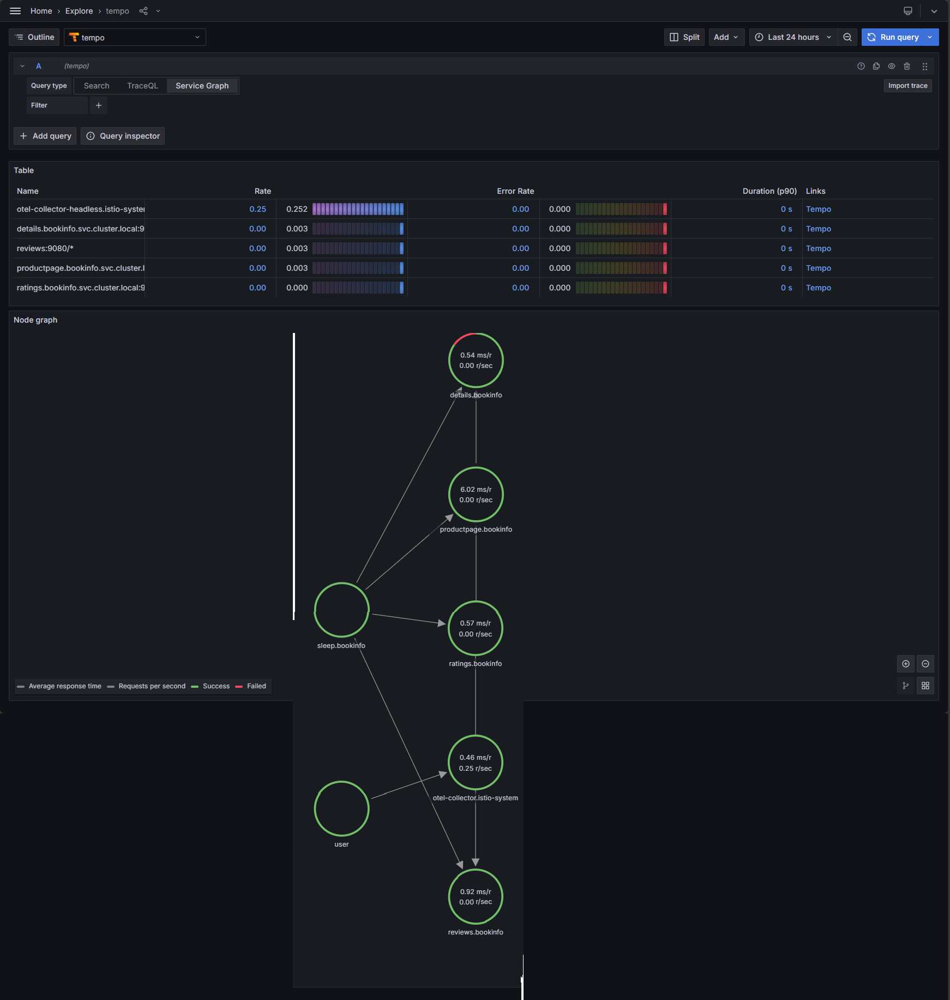
---

## Validation Commands

```powershell
oc -n tracing-system get pods
oc -n bookinfo get svc
```

---

## Result

Distributed tracing + Tempo + Metrics-Generator + Service Graph working successfully.


---

# FINAL VALIDATION CHECKLIST

- Bookinfo deployed
- Istio sidecars injected
- OTEL Collector running
- Tempo running
- Grafana datasource configured
- Traces visible
- Service graph visible

---

# CLEANUP (OPTIONAL)

```powershell
oc delete project bookinfo
oc delete project tracing-system
oc delete opentelemetrycollector otel -n istio-system
```

# APPENDEX

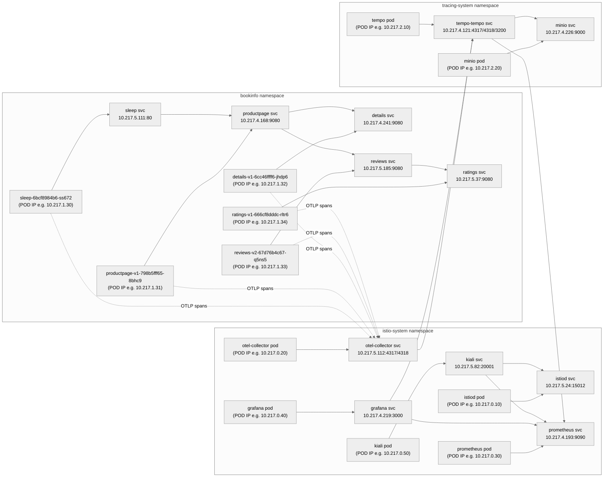

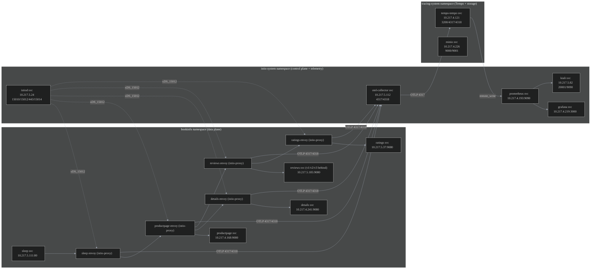