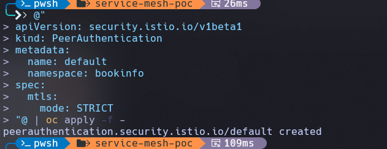
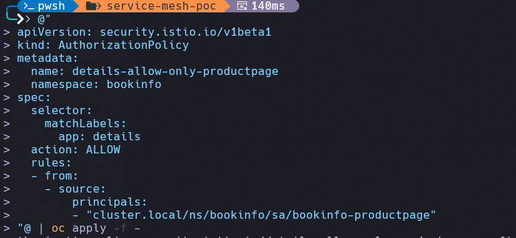
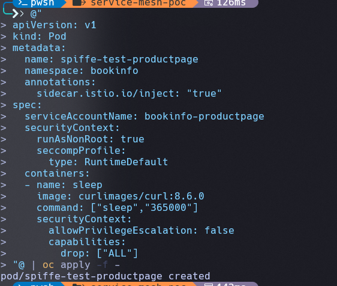
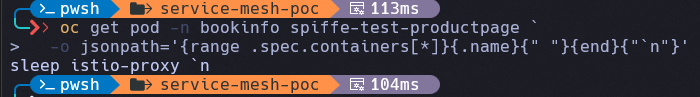
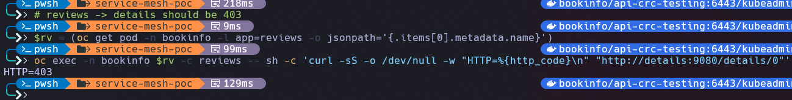
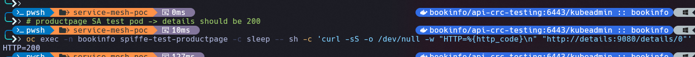
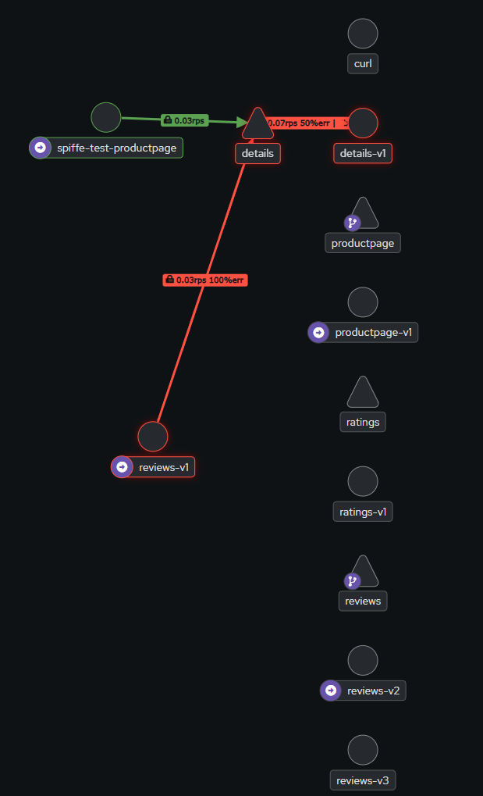
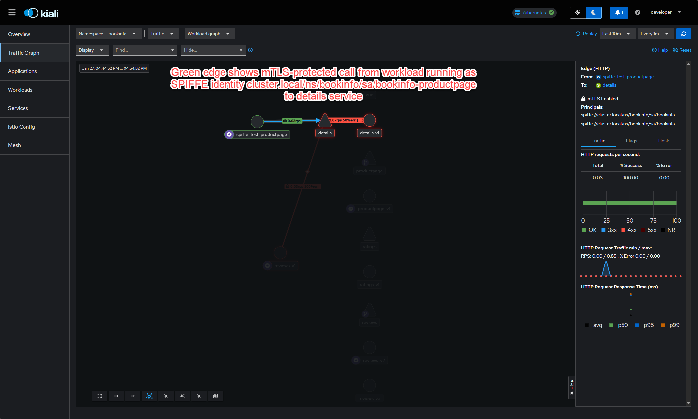
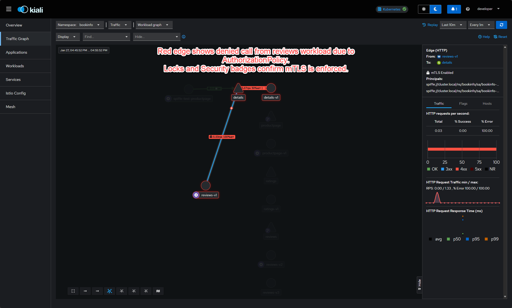

# PoC Guide: mTLS + SPIFFE with OpenShift Service Mesh 3 (Bookinfo)

This guide walks through a working proof-of-concept on **OpenShift Local (CRC)** using **Red Hat OpenShift Service Mesh 3** and **Bookinfo**:

-   Enable **STRICT mTLS** with `PeerAuthentication`
-   Verify **SPIFFE workload identities**
-   Enforce **identity-based authorization** (ALLOW only Productpage identity to call Details)
-   Visualize **Allowed vs Denied** traffic in **Kiali**

> **Important SM3 Quirk**: Run as **kubeadmin** in CRC. In this SM3 build, `AuthorizationPolicy.spec.rules[].from[].source.principals` gets auto-prefixed with `spiffe://` in Envoy RBAC config. **So do not include `spiffe://` in the policy value**, otherwise it becomes `spiffe://spiffe://...` and never matches.

------------------------------------------------------------------------

## Prerequisites

-   OpenShift Local (CRC) with cluster running
-   Service Mesh 3 installed (istiod/kiali/grafana/prometheus running)
-   Bookinfo deployed in namespace `bookinfo`
-   `oc` CLI working and logged in as kubeadmin

Quick checks:

``` powershell
oc whoami
oc get ns | grep -E '^bookinfo|^istio-system'
oc get pods -n istio-system
oc get pods -n bookinfo
```

Expected: Bookinfo workloads should show **2/2** containers (app +
`istio-proxy`).

------------------------------------------------------------------------

## 1. Baseline: Confirm Details is reachable (before changing security)

``` powershell
$REVIEWS=$(oc get pod -n bookinfo -l app=reviews -o jsonpath='{.items[0].metadata.name}')
oc exec -n bookinfo $REVIEWS -c reviews --   curl -sS -o /dev/null -w "HTTP=%{http_code}
" http://details:9080/details/0
```

Expected:

    HTTP=200

------------------------------------------------------------------------

## 2. Create PeerAuthentication to enable STRICT mTLS

This turns on **mutual TLS** for all workloads in the `bookinfo`
namespace.

``` powershell
@"
apiVersion: security.istio.io/v1beta1
kind: PeerAuthentication
metadata:
  name: default
  namespace: bookinfo
spec:
  mtls:
    mode: STRICT
"@ | oc apply -f -
```

Verify:

``` powershell
oc get peerauthentication -n bookinfo -o wide
```

------------------------------------------------------------------------

## 3. Confirm traffic still works under STRICT mTLS

``` powershell
$REVIEWS=$(oc get pod -n bookinfo -l app=reviews -o jsonpath='{.items[0].metadata.name}')
oc exec -n bookinfo $REVIEWS -c reviews --   curl -sS -o /dev/null -w "HTTP=%{http_code}
" http://details:9080/details/0
```

Expected:

    HTTP=200

If you do NOT get 200 here, stop and fix mTLS egress policy
(DestinationRule) before continuing.

------------------------------------------------------------------------

## 4. Verify SPIFFE workload identity

### 4.1 Productpage SPIFFE ID (from sidecar certs)

``` powershell
$PP = oc get pod -n bookinfo -l app=productpage -o jsonpath='{.items[0].metadata.name}'
oc exec -n bookinfo $PP -c istio-proxy -- curl -s http://localhost:15000/certs | Select-String -Pattern 'spiffe://[^"]*' -AllMatches | ForEach-Object { $_.Matches.Value } | Sort-Object -Unique
```

Example output:

    spiffe://cluster.local/ns/bookinfo/sa/bookinfo-productpage

### 4.2 (Optional) Reviews SPIFFE ID

``` powershell
$REVIEWS = oc get pod -n bookinfo -l app=reviews -o jsonpath='{.items[0].metadata.name}'
oc exec -n bookinfo $REVIEWS -c istio-proxy -- curl -s http://localhost:15000/certs | Select-String -Pattern 'spiffe://[^"]*' -AllMatches | ForEach-Object { $_.Matches.Value } | Sort-Object -Unique
```

------------------------------------------------------------------------

## 5. Create AuthorizationPolicy to allow ONLY Productpage identity to call Details

⚠️ **Important SM3 quirk**: Use principal **without** `spiffe://`
prefix.

Correct value:

    cluster.local/ns/bookinfo/sa/bookinfo-productpage

Apply policy:

``` powershell
@"
apiVersion: security.istio.io/v1beta1
kind: AuthorizationPolicy
metadata:
  name: details-allow-only-productpage
  namespace: bookinfo
spec:
  selector:
    matchLabels:
      app: details
  action: ALLOW
  rules:
  - from:
    - source:
        principals:
        - "cluster.local/ns/bookinfo/sa/bookinfo-productpage"
"@ | oc apply -f -
```

Verify:

``` powershell
oc get authorizationpolicy -n bookinfo details-allow-only-productpage -o yaml
```

------------------------------------------------------------------------

## 6. Create an injected curl test pod that runs as Productpage service account

We created a minimal test pod that runs with the same ServiceAccount as productpage. This pod contains no application logic; it only issues curl requests. When this pod is allowed to call details while other workloads are denied, it proves that access control is based solely on the SPIFFE identity derived from the mTLS certificate, not on application code.

Productpage container doesn't include curl in some images, so we use a
small curl pod + sidecar injection, running under SA
`bookinfo-productpage`.

``` powershell
@"
apiVersion: v1
kind: Pod
metadata:
  name: spiffe-test-productpage
  namespace: bookinfo
  annotations:
    sidecar.istio.io/inject: "true"
spec:
  serviceAccountName: bookinfo-productpage
  securityContext:
    runAsNonRoot: true
    seccompProfile:
      type: RuntimeDefault
  containers:
  - name: sleep
    image: curlimages/curl:8.6.0
    command: ["sleep","365000"]
    securityContext:
      allowPrivilegeEscalation: false
      capabilities:
        drop: ["ALL"]
"@ | oc apply -f -
```

Wait:

``` powershell
oc wait -n bookinfo --for=condition=Ready pod/spiffe-test-productpage --timeout=180s
```

Confirm sidecar is present:

``` powershell
oc get pod -n bookinfo spiffe-test-productpage `
  -o jsonpath='{range .spec.containers[*]}{.name}{" "}{end}{"`n"}'

```


Expected to include: `sleep istio-proxy`

------------------------------------------------------------------------

## 7. Validate: Denied vs Allowed

### 7.1 DENIED: Reviews → Details (should be 403)

``` powershell
$REVIEWS = oc get pod -n bookinfo -l app=reviews -o jsonpath='{.items[0].metadata.name}'
oc exec -n bookinfo $REVIEWS -c reviews -- curl -sS -o /dev/null -w "HTTP=%{http_code}\n" http://details:9080/details/0
```

Expected:

    HTTP=403

### 7.2 ALLOWED: Productpage identity test pod → Details (should be 200)

``` powershell
oc exec -n bookinfo spiffe-test-productpage -c sleep -- curl -sS -o /dev/null -w "HTTP=%{http_code}\n" http://details:9080/details/0
```

Expected:

    HTTP=200

------------------------------------------------------------------------

## 8. Visualize in Kiali

### 8.1 Open Kiali

``` powershell
oc get route -n istio-system kiali -o jsonpath='{.spec.host}'
```

Open:

    https://<host>

### 8.2 Generate traffic (so the Graph shows edges)

``` powershell
# Allowed traffic
1..20 | ForEach-Object {
  oc exec -n bookinfo spiffe-test-productpage -c sleep -- curl -s http://details:9080/details/0 | Out-Null
}

# Denied traffic
$REVIEWS = oc get pod -n bookinfo -l app=reviews -o jsonpath='{.items[0].metadata.name}'
1..20 | ForEach-Object {
  oc exec -n bookinfo $REVIEWS -c reviews -- curl -s http://details:9080/details/0 | Out-Null
}
```

### 8.3 View Graph

In Kiali UI:

-   Namespace: `bookinfo`
-   Graph Type: `Service Graph` or `Workload Graph`
-   Enable:
    -   Security
    -   Traffic Animation
    -   mTLS


You should see:

-   productpage → details with **lock icon** (mTLS)

-   reviews → details with **error rate / red edge**


------------------------------------------------------------------------

## Troubleshooting

**Problem: Pods showing 1/1 instead of 2/2 (no sidecar)**
- Check namespace has injection label: `oc get namespace bookinfo -o yaml | grep istio-injection`
- Verify istiod is running: `oc get pods -n istio-system -l app=istiod`

**Problem: Getting 403 from both productpage and reviews identities**
- Verify PeerAuthentication is STRICT: `oc get peerauthentication -n bookinfo -o yaml`
- Check DestinationRule has proper mTLS mode configured

**Problem: AuthorizationPolicy not working**
- Verify SPIFFE ID matches exactly (no `spiffe://` prefix in principal value)
- Check the exact identity: `oc exec -n bookinfo $POD -c istio-proxy -- curl -s http://localhost:15000/certs | grep URI`
- Ensure pod was created AFTER PeerAuthentication was applied

**Problem: Kiali not showing traffic**
- Generate more traffic (run the curl loops again)
- Refresh Kiali graph and check time range
- Verify Display options: enable Security, Traffic Animation, mTLS

------------------------------------------------------------------------

## Summary Commands (copy/paste)

``` powershell
# get details pod, 
# confirm the policy name is present in the details proxy config
$dp = (oc get pod -n bookinfo -l app=details -o jsonpath='{.items[0].metadata.name}')
oc exec -n bookinfo $dp -c istio-proxy -- sh -c 'curl -s http://localhost:15000/config_dump | grep -n "details-allow-only-productpage" | head -n 20'
# 29541:                 "ns[bookinfo]-policy[details-allow-only-productpage]-rule[0]": {
# 29845:              "ns[bookinfo]-policy[details-allow-only-productpage]-rule[0]": {
# 30064:                 "ns[bookinfo]-policy[details-allow-only-productpage]-rule[0]": {

# Dump a focused window around the first occurrence (adjust line count if needed)
oc exec -n bookinfo $dp -c istio-proxy -- sh -c 'curl -s http://localhost:15000/config_dump | sed -n "29520,29620p"'

# STRICT mTLS on?
oc get peerauthentication -n bookinfo

# SPIFFE ID on productpage
PP=$(oc get pod -n bookinfo -l app=productpage -o jsonpath='{.items[0].metadata.name}')
oc exec -n bookinfo $PP -c istio-proxy --   curl -s http://localhost:15000/certs | grep -o 'spiffe://[^" ]*' | sort -u

# Policy applied?
oc get authorizationpolicy -n bookinfo details-allow-only-productpage -o yaml

# DENIED check
REVIEWS=$(oc get pod -n bookinfo -l app=reviews -o jsonpath='{.items[0].metadata.name}')
oc exec -n bookinfo $REVIEWS -c reviews --   curl -sS -o /dev/null -w "HTTP=%{http_code}
" http://details:9080/details/0

# ALLOWED check
oc exec -n bookinfo spiffe-test-productpage -c sleep --   curl -sS -o /dev/null -w "HTTP=%{http_code}
" http://details:9080/details/0
```

------------------------------------------------------------------------

## Cleanup (copy/paste)

``` powershell
oc delete pod -n bookinfo spiffe-test-productpage --ignore-not-found
oc delete authorizationpolicy -n bookinfo details-allow-only-productpage --ignore-not-found
oc delete peerauthentication -n bookinfo default --ignore-not-found
```

------------------------------------------------------------------------

## Conceptual diagram

    spiffe-test-productpage (SA=bookinfo-productpage, SPIFFE identity)
       └── mTLS (SPIFFE) ──► details   ✅ allowed

    reviews (SPIFFE identity)
       └── mTLS (SPIFFE) ──► details   ❌ denied by AuthorizationPolicy

------------------------------------------------------------------------