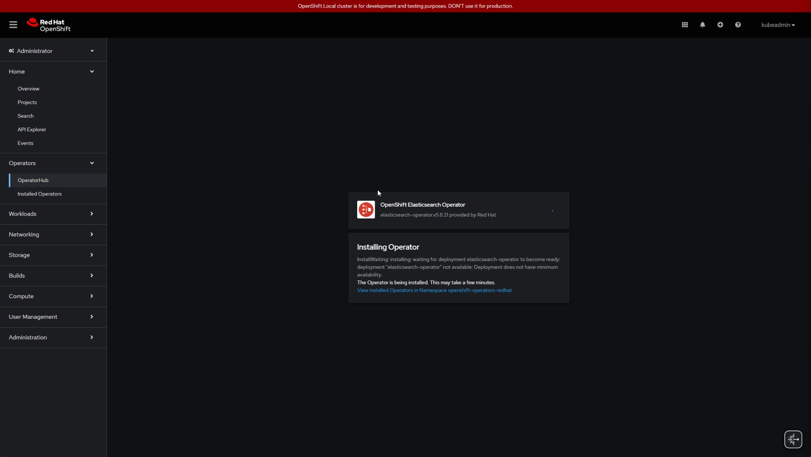
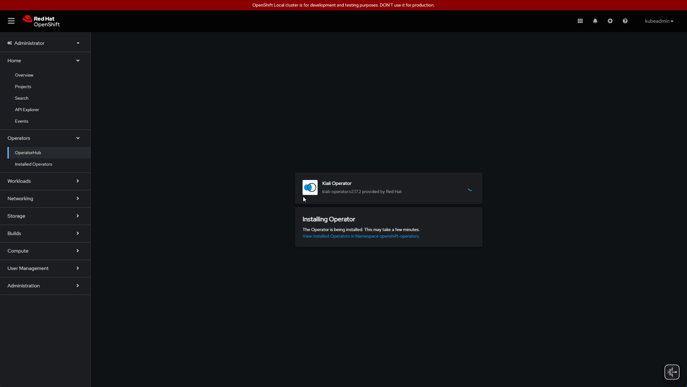
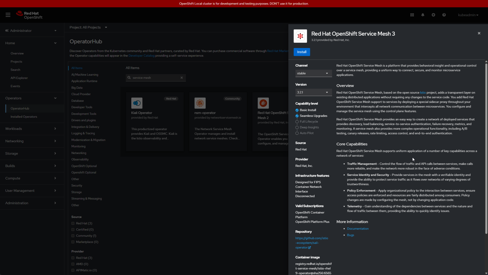
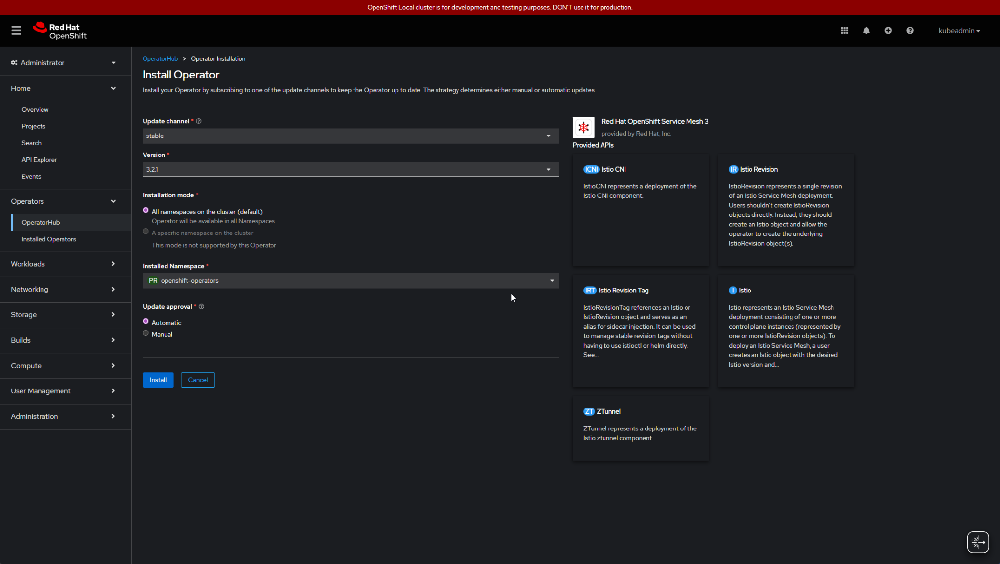
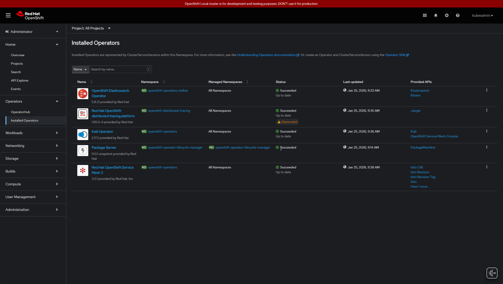
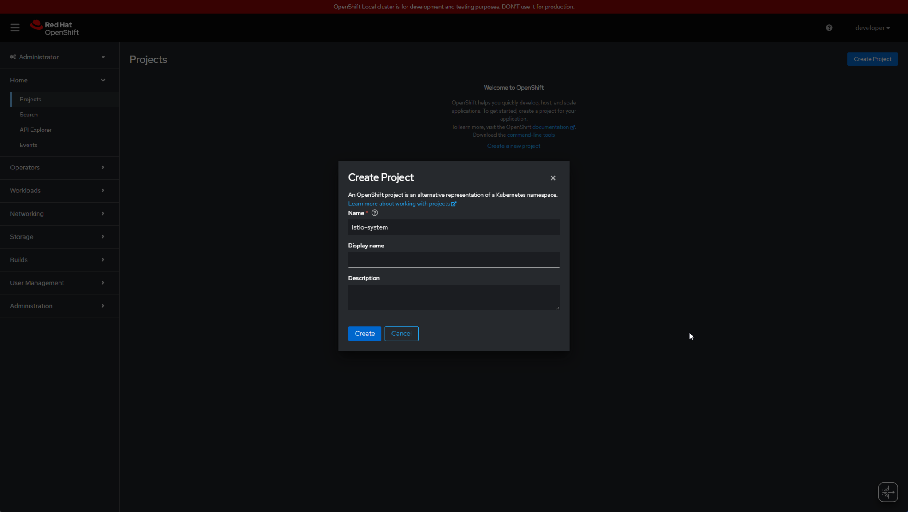
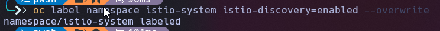
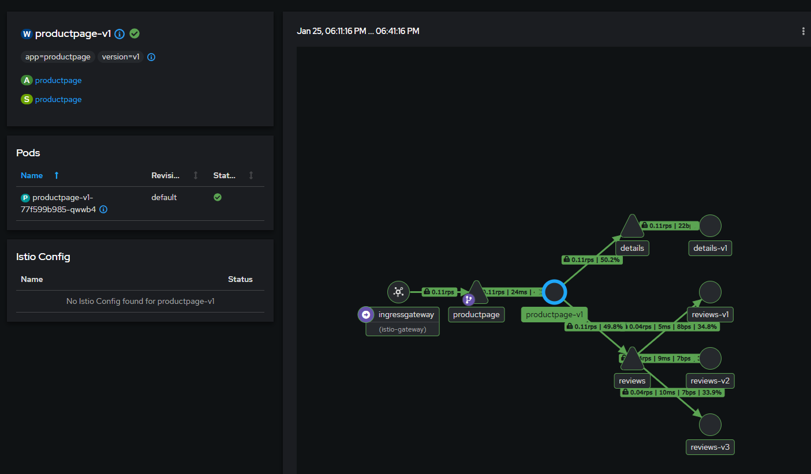
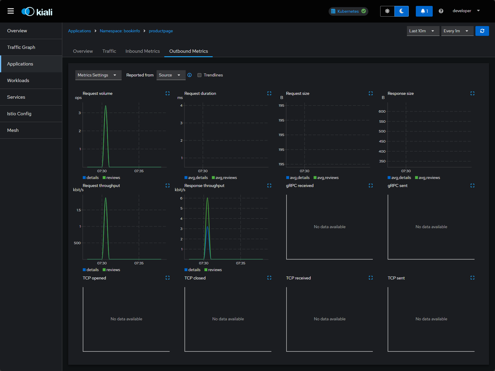
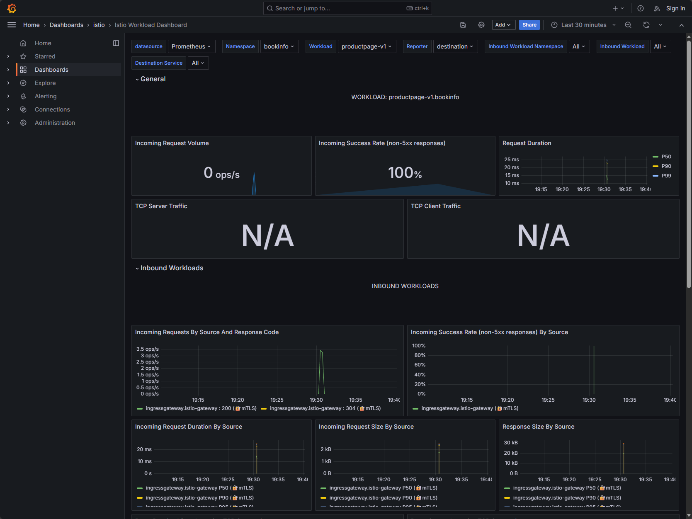

# OpenShift Local (CRC) --- Service Mesh 3 PoC + Bookinfo + Gateway + Kiali

This guide walks through setting up **Red Hat OpenShift Service Mesh 3
(OSSM 3)** on OpenShift Local (CRC), deploying the Bookinfo sample
application, exposing it through an ingress gateway, and visualizing
traffic with Kiali.

Mesh toplogy


BookInfo Site


------------------------------------------------------------------------

## Conventions

-   **Role: kubeadmin** = cluster-admin tasks\
-   **Role: developer** = application namespace tasks

------------------------------------------------------------------------

## 0) CRC Sizing (Recommended) and Install prerequsite operators

``` powershell
crc config set memory 24576
crc config set cpus 8
crc config set disk-size 120
crc stop
crc start
```
### 0.1 Install Elasticsearch Operator

### 0.2 Install Jaeger Operator

### 0.3 Install Kiali Operator

------------------------------------------------------------------------

## 1) Install Service Mesh 3 Operator

Web Console → Operators → OperatorHub →\
Install **Red Hat OpenShift Service Mesh 3 Operator**



These are all operators we installed.


------------------------------------------------------------------------

## 2) Create Control Plane Projects

OSSM3 deploysthe control plane and CNI into separate projects
``` powershell
oc new-project istio-system
oc new-project istio-cni
```


------------------------------------------------------------------------

## 3) Create Service Mesh 3 Control Plane (Sail)

### 3.1 Istio

``` yaml
apiVersion: sailoperator.io/v1
kind: Istio
metadata:
  name: default
  namespace: istio-system
spec:
  updateStrategy:
    type: InPlace
  version: v1.24-latest
  discoverySelectors:
  - matchLabels:
      istio-discovery: enabled
```

```powershell
oc apply -f istio.yaml
```

### 3.2 IstioCNI

``` yaml
apiVersion: sailoperator.io/v1
kind: IstioCNI
metadata:
  name: default
  namespace: istio-cni
spec:
  version: v1.24-latest
```

``` powershell
oc apply -f istiocni.yaml
```

### 3.3 Label Namespace

``` powershell
oc label namespace istio-system istio-discovery=enabled --overwrite
```

### 3.4 Verify

``` powershell
oc get istio -n istio-system
oc get istiorevisions -n istio-system
oc get pods -n istio-system
oc get pods -n istio-cni
```

------------------------------------------------------------------------

## 4) Deploy Bookinfo

``` powershell
oc new-project bookinfo
```

``` powershell
oc label namespace bookinfo istio-discovery=enabled --overwrite
oc label namespace bookinfo istio-injection=enabled --overwrite
```

``` powershell
oc apply -n bookinfo -f https://raw.githubusercontent.com/openshift-service-mesh/istio/release-1.24/samples/bookinfo/platform/kube/bookinfo.yaml
```

Verify:

``` powershell
oc get pods -n bookinfo
```

------------------------------------------------------------------------

## 5) Create Gateway + VirtualService

``` powershell
oc apply -n bookinfo -f https://raw.githubusercontent.com/openshift-service-mesh/istio/release-1.24/samples/bookinfo/networking/bookinfo-gateway.yaml
```

``` powershell
oc get gateway,virtualservice -n bookinfo
```

------------------------------------------------------------------------

## 6) Create Ingress Gateway (Gateway Injection)

``` powershell
oc create namespace istio-gateway
oc label namespace istio-gateway istio-discovery=enabled --overwrite
```

Apply gateway workload:

``` powershell
oc apply -f ingress-gateway.yaml
```

Verify:

``` powershell
oc get pods -n istio-gateway
oc get svc -n istio-gateway
```

------------------------------------------------------------------------

## 7) Expose Gateway

``` powershell
oc -n istio-gateway expose svc/ingressgateway --name=bookinfo --port=http2
oc get route -n istio-gateway bookinfo
```

------------------------------------------------------------------------

## 8) Fix Port Mapping (Envoy listens on 8080)

``` powershell
oc -n istio-gateway patch svc ingressgateway --type='json' -p='[{"op":"replace","path":"/spec/ports/1/targetPort","value":8080}]'
```

Open:

    http://bookinfo-istio-gateway.apps-crc.testing/productpage

------------------------------------------------------------------------

## 9) Install Kiali

Install **Kiali Operator provided by Red Hat**

Create Kiali:

``` yaml
apiVersion: kiali.io/v1alpha1
kind: Kiali
metadata:
  name: kiali
  namespace: istio-system
spec:
  auth:
    strategy: openshift
  deployment:
    accessible_namespaces:
      - "**"
  external_services:
    istio:
      root_namespace: istio-system
```

``` powershell
oc apply -f kiali.yaml
```

Expose:

``` powershell
oc -n istio-system expose svc/kiali
oc get route -n istio-system kiali
```

Login using OpenShift credentials.

------------------------------------------------------------------------

## 10) Install Prometheus Addon

``` powershell
oc apply -n istio-system -f https://raw.githubusercontent.com/istio/istio/release-1.24/samples/addons/prometheus.yaml
```

Patch Kiali:

``` powershell
oc -n istio-system patch kiali kiali --type=merge -p '{"spec":{"external_services":{"prometheus":{"url":"http://prometheus.istio-system:9090"}}}}'
oc -n istio-system rollout restart deploy/kiali
```

------------------------------------------------------------------------

## 11) Generate Traffic

``` powershell
$gw = "http://bookinfo-istio-gateway.apps-crc.testing"
for ($i=0; $i -lt 100; $i++) {
  curl "$gw/productpage" | Out-Null
}
```

Open Kiali → Namespace `bookinfo` → Graph → Last 5m




------------------------------------------------------------------------

## Success

We now have:

-   OSSM 3 running
-   Bookinfo injected
-   Gateway exposed
-   Kiali showing traffic graph

------------------------------------------------------------------------